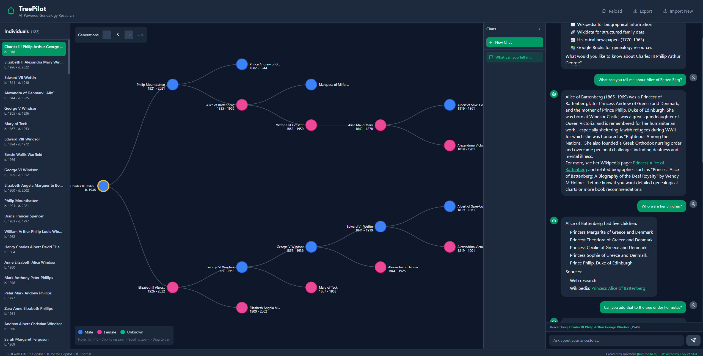
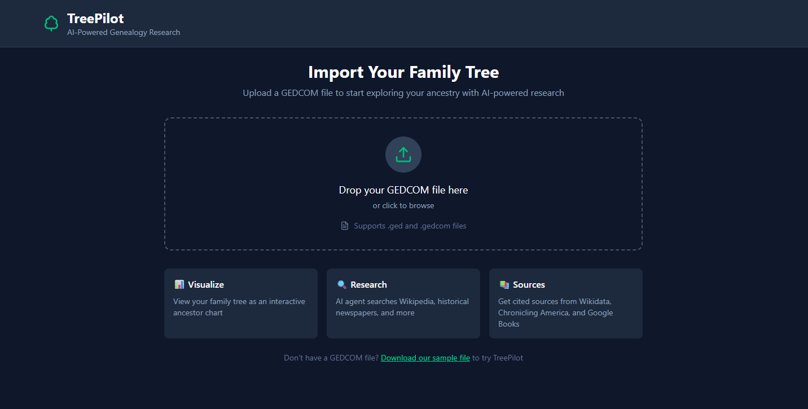

# TreePilot 🌳

**AI-Powered Genealogy Research Agent** built with the [GitHub Copilot SDK](https://github.com/github/copilot-sdk)

> Built for the [Copilot SDK Weekend Contest](https://www.reddit.com/r/GithubCopilot/comments/1qkz7oj/lets_build_copilot_sdk_weekend_contest_with_prizes/)

## Features

- **GEDCOM Import** - Load your family tree from standard GEDCOM files
- **Interactive Ancestor Tree** - D3.js visualization of your ancestors
- **AI Research Agent** - Powered by GitHub Copilot SDK with custom tools
- **Multi-Source Research** - Searches Wikipedia, Wikidata, historical newspapers, and Google Books


## Screenshots





## Tech Stack

### Backend
- **Python 3.9+** with FastAPI
- **GitHub Copilot SDK** for agent orchestration
- **python-gedcom** for GEDCOM parsing
- Custom research tools:
  - Wikipedia REST API
  - Wikidata SPARQL queries
  - Chronicling America (historical newspapers 1770-1963)
  - Google Books API
  - Tavily Web Search (backup for MCP web_search)

### Frontend
- **React 18** with TypeScript
- **Vite** for fast development
- **TailwindCSS** for styling
- **D3.js** for family tree visualization
- **React Markdown** for rendering AI responses

## Prerequisites
*(**Important**: For decent results enable bing websearch tool use in your [copilot settings](https://github.blog/changelog/2024-10-29-web-search-in-github-copilot-chat-now-available-for-copilot-individual/))*  
*Or get a [tavily key](https://www.tavily.com/)*

1. **GitHub Copilot subscription** and a git PAT token 
     
2. **Copilot CLI** installed
3. **Python 3.9+** and **Node.js 18+**

## Quick Start

### 1. Clone and Setup

```bash
git clone https://github.com/yourusername/treepilot.git
cd treepilot
```
### 2. Config your .env

Config your .env file with your GITHUB token, and google books token (optional)

```md
# GitHub token for MCP server authentication (required)
GITHUB_TOKEN=your_github_token_here

# Optional: Google Books API key for higher rate limits
GOOGLE_BOOKS_API_KEY=your_api_key_here

# Optional: Tavily API key for backup web search
# Get a free key at: https://tavily.com (1000 searches/month free)
TAVILY_API_KEY=your_tavily_api_key_here
```

### 2. Backend Setup

```bash
cd backend

# Create virtual environment
python -m venv venv
venv\Scripts\activate  # Windows
# source venv/bin/activate  # macOS/Linux

# Install dependencies
pip install -r requirements.txt

# Start the server
.\venv\Scripts\python.exe main.py
```

The backend runs on `http://localhost:8000`

### 3. Frontend Setup

```bash
cd frontend

# Install dependencies
npm install

# Start development server
npm run dev
```

The frontend runs on `http://localhost:5173`

### 4. Open TreePilot

Navigate to `http://localhost:5173` in your browser.

## Usage

1. **Import GEDCOM** - Upload your family tree file (or use the included `sample-family.ged`)
2. **Browse Tree** - Click on individuals to see their ancestor tree
3. **Research** - Click a person and switch to the Research tab to have the AI agent search for information

## Sample GEDCOM

A sample GEDCOM file is included (`sample-family.ged`)

## API Endpoints

| Endpoint | Method | Description |
|----------|--------|-------------|
| `/health` | GET | Health check |
| `/upload-gedcom` | POST | Upload and parse GEDCOM file |
| `/individuals` | GET | List all individuals |
| `/tree/{person_id}` | GET | Get ancestor tree for a person |
| `/youngest` | GET | Get youngest generation |
| `/export-gedcom` | GET | Download modified GEDCOM file |
| `/change-history` | GET | View metadata change history |
| `/chat` | POST | Non-streaming chat |
| `/chat/stream` | POST | Streaming chat (SSE) |

## Research Tools

The AI agent has access to:

### External Research Tools

1. **Wikipedia** (`search_wikipedia`)
   - Biographical information
   - Historical context
   - Notable individuals

2. **Wikidata** (`search_wikidata`)
   - Structured data (birth/death dates, places)
   - Family relationships
   - Occupations

3. **Chronicling America** (`search_newspapers`)
   - Historical newspapers 1770-1963
   - Obituaries, birth/marriage announcements
   - Local news mentions

4. **Google Books** (`search_books`)
   - Genealogy guidest
   - Local histories
   - Biographical works

5. **Tavily Web Search** (`search_web_tavily`)
   - Backup web search when GitHub MCP `#web_search` is unavailable
   - Searches ancestry databases, immigration records, family histories
   - Results are cached for 1 hour to optimize API usage
  

### Family Tree Tools (GEDCOM)

The AI can query and update your family tree directly:

**Read Tools:**
- `get_person_metadata` - Full details (name, dates, places, occupation, notes)
- `get_person_parents` - Get a person's parents
- `get_person_children` - Get a person's children
- `get_person_spouses` - Get a person's spouse(s)
- `get_person_siblings` - Get a person's siblings
- `get_person_grandparents` - Get a person's grandparents
- `get_person_aunts_uncles` - Get a person's aunts and uncles
- `get_person_cousins` - Get a person's cousins

**Write Tools:**
- `update_person_metadata` - Add/update notes, occupation, birth/death places, custom facts
- `undo_last_change` - Revert the most recent metadata update

## Environment Variables

Create a `.env` file in the `backend` folder:

```env
# GitHub token for MCP server authentication (required)
GITHUB_TOKEN=your_github_token_here

# Optional: Google Books API key for higher rate limits
GOOGLE_BOOKS_API_KEY=your_api_key_here

# Optional: Tavily API key for backup web search
# Get a free key at: https://tavily.com (1000 searches/month free)
TAVILY_API_KEY=your_tavily_api_key_here
```

### Getting a GitHub Token

1. Go to [GitHub Settings > Personal Access Tokens](https://github.com/settings/tokens)
2. Click "Generate new token (classic)"
3. Give it a descriptive name (e.g., "TreePilot MCP")
4. Select appropriate scopes (minimal permissions needed)
5. Generate and copy the token
6. Add it to your `.env` file as `GITHUB_TOKEN=ghp_...`

## License

MIT License - see [LICENSE](LICENSE) for details.

## Acknowledgments

- [GitHub Copilot SDK](https://github.com/github/copilot-sdk) - Agent framework
- [Chronicling America](https://chroniclingamerica.loc.gov/) - Library of Congress newspaper archive
- [Wikidata](https://www.wikidata.org/) - Free knowledge base
- [python-gedcom](https://github.com/nickreynke/python-gedcom) - GEDCOM parsing library

---

**Built with ❤️ for the Copilot SDK Weekend Contest**
